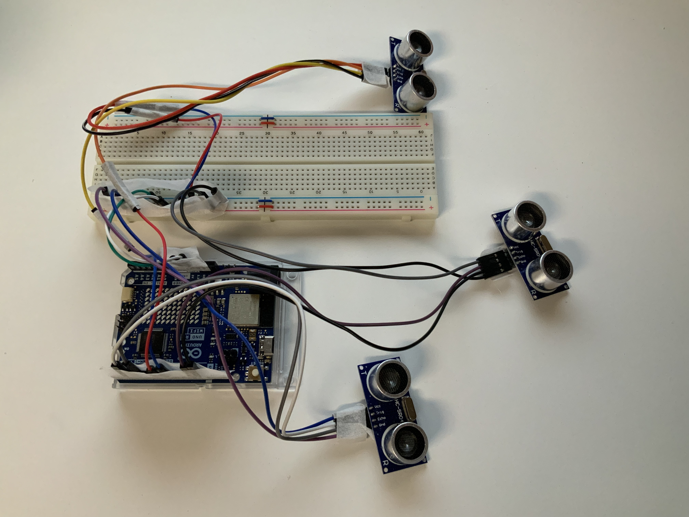

2025 Sheridan Capstone Project Team 15

Project Name: Smart Waste Management System

- Professor:
    - Kevin Anstey
- Team Member:
    - Shuya Hu
    - Dohee Kim
    - Jie Chen
    - Sichao Quan

## Introduction

Noticing how trash bins overflows, especially during peak hours in shopping malls, campuses, and so many other places, our team came up with this solution to address this issue: build a project to monitor the fullness of the trash bin in real-time and send an email notification to janitors if a trash bin is full. The purpose here is to help the clients maintain a clean environment while reducing the workload of janitors.

## Design:

## Demo

Demonstration: https://youtu.be/5-iySpclYTk

## Technologies

### Summary

|                            |                     Technology                      |                                                                                     Description                                                                                      |
| :------------------------: | :-------------------------------------------------: | :----------------------------------------------------------------------------------------------------------------------------------------------------------------------------------: |
|   IoT Data Transmission    |                    MQTT protocol                    |                                                                       The most commonly used protocol for IoT                                                                        |
|   Sensors and Controller   | Ultrasonic Sensor (HC-SR04) Arduino UNO R4 Wi-Fi |                                                                           Detect and measure waste levels                                                                            |
| Wireless Data Transmission |                        Wi-Fi                        |                                                                             More reliable than Bluetooth                                                                             |
|  Language for Controller   |                         C++                         |                                Develop the microcontroller for  1. Read and process the data from the sensor  2. Send the data to RaspberryPi.                                 |
|           Server           |                 Java (Spring Boot)                  | Responsibilities:  1. Get the data from the Raspberry Pi  2. CRUD APIs  3. Send Data to the web app for visualization  4. Send notifications to users. 5. Authorize user |
|          Database          |                       MariaDB                       |                                                        The database is hosted on the Raspberry Pi for localized data storage.                                                        |
|    Frontend Development    |                Angular + TypeScript                 |                                                 For data visualization. The web server is hosted locally on a Raspberry Pi. Provide                                                  |

### Detail

#### Hardware and Sensor Reading Data Flow

For the controller, we chose Arduino UNO R4 Wi-Fi to start with. It offers various modules to explore, which was preferable because at the starting phase of our project, we needed to test out different technologies to find the one that suits our projects best.

For the sensor, we chose the proximity sensor: ultrasonic sensor HC-SR04. By far, it detects the distance accurately and stably.

The Arduino IDE and C++ were chosen to program the controller. In addition to collecting proximity data from the sensors, the controller also functions as an MQTT publisher using the `ArduinoMqttClient` library. We published the data to 2 different topics: `smartwaste/sensor/reading-data` and `smartwaste/sensor/metadata`.

Three sensors are connected to one controller(see the picture above), simulating the scenario that most trash bins come in a bundle of 3\. One unique sensor is identified by the MAC address of the controller it is connected to and the PIN it is using. Once the controller is plugged in, it will first try to connect to Wi-Fi, then to the MQTT broker, which is running on the Raspberry Pi.

The controller will send the sensor’s ID to the `metadata` topic. The Java server, which is running on Raspberry Pi, will check the MAC address and the PIN. A new sensor will be created if it hasn’t already. After the automatic data setup, the sensor will publish reading data under the topic `reading-data`. The Java server will store the data for future reading and visualization.

On the Raspberry Pi, the MQTT broker mosquitto is running, serving both as a subscriber and a publisher. It subscribes to the controller and publishes the data to the Java server. In this case, the Java server is an MQTT subscriber by integrating Eclipse Paho into it.

The Java server will validate, process, and store the data accordingly.

**Highlights** of this part: The **connection of the hardware**, the design of the d**ata pipeline using the MQTT protocol**, the logic of **registering a new sensor automatically**, and the **initial setup of the server**.

#### The Connection between the Sensor and the Bin

After we were able to detect the sensor, the next step was to connect the bin with the sensor. The solution was to build a webpage for the admin to manage the sensor and the bin. In our front-end application, we can add a bin, including its location, height, connected sensor, name, threshold, assigned janitors, and all other attributes. The server calculates the fullness of the trash bin periodically. It will send an email to the assigned janitor when the fullness has reached the preset threshold.

**Highlights** of this part: The **design of relational database logic**, the f**ull CRUD operation** of the trash bin and the janitors, and the **integration of Google Maps**.

#### Authentication and Security

As long as the user is using the same network as the Raspberry Pi, they can visit the trashbin page as a tourist. In this way, they can find the nearest available trash bin. The janitors can also monitor the general status of all the trash bins.

We also provide the admin role. Admin can modify all the data in the database, such as register new janitors, add bins, assign sensors, etc. For this part, we used SprintBoot JWT.

**Highlights** of this part: the implementation of authentication using **JWT**.

#### Front-end Website

We chose Angular to build our website and Nginx to host the website on the Raspberry Pi. The website is component-based, so we could add more functions later on if needed. We also provide responsive design and dark mode.

**Highlights** for this part: **Fully functional website**. Responsive design. Dark Mode.

## Team Collaboration

We used different methodologies to ensure efficient communication and collaboration:

1. Version Control: We managed source code within Azure Repos using **Git**, ensuring high code quality via structured branch policies.
2. **Agile** Methodology: We used the Azure dashboard to organize, track, and monitor our tasks and sprints, including sprint planning, retrospectives, and other agile methodologies.
3. We also kept efficient and on-time communication through Microsoft Teams Chat.
